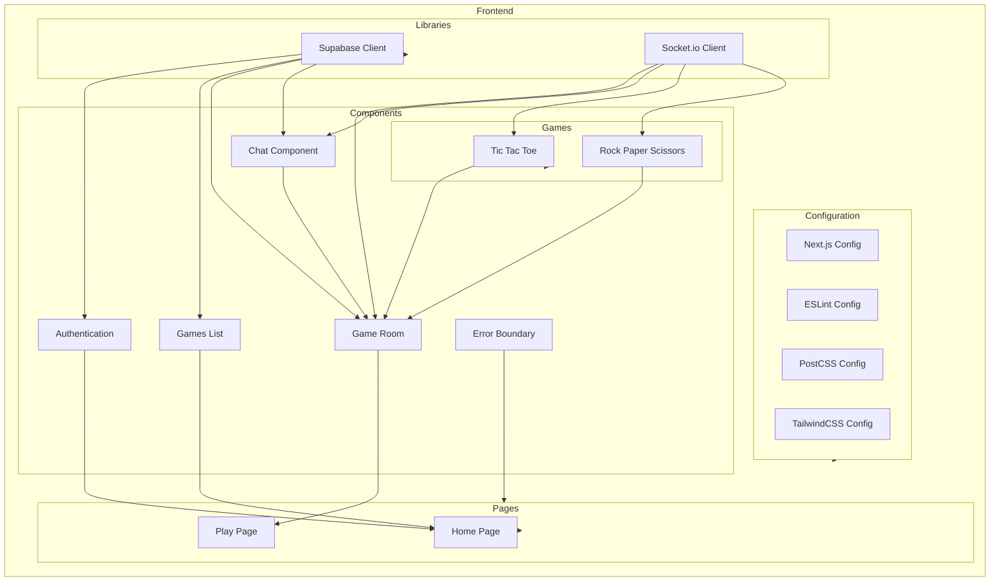

    

    <b>Automatic Architecture Diagrams from Code</b> 
    <a href="https://github.com/swark-io/swark">GitHub</a> • <a href="https://swark.io">Website</a> • <a href="mailto:contact@swark.io">Contact Us</a>

## Usage Instructions

1. **Render the Diagram**: Use the links below to open it in Mermaid Live Editor, or install the [Mermaid Support](https://marketplace.visualstudio.com/items?itemName=bierner.markdown-mermaid) extension.
2. **Recommended Model**: If available for you, use `claude-3.5-sonnet` [language model](vscode://settings/swark.languageModel). It can process more files and generates better diagrams.
3. **Iterate for Best Results**: Language models are non-deterministic. Generate the diagram multiple times and choose the best result.

## Generated Content
**Model**: GPT-4o - [Change Model](vscode://settings/swark.languageModel)  
**Mermaid Live Editor**: [View](https://mermaid.live/view#pako:eNqFVMtuqzAQ_RXL67YfkEWle9PXIqqiwM50MYFJ4hZs5Ifujar-e22DSTGO6gU6M-eQeXCcT1rLBumKVuKooD-R8qESxB1t90PiSUlhUDRDekatpTjwo1VguBQX3h-B_81As1cH7971qH6b61C3XETlY7FxQV7YS21qrUfl1kXroshLDfD2HxfNqC1jmNPnB9vwvQLFUc9_WNse9qDR0awYMVm3HIVJWtCy_kATdAHdcbkUXltq10vhlEnxP9acmH84itdh5UnRZ-hQb7g2LCDiYUayk7ILCuJRIlifwDD_uPSRjhYbDUXmnD8lr0uoS4nMIeIgcfhtqdu5xWyhR1XUXGupNPMZElIk5lK3_NyYP49KSfVXWtGAOrMQkRj-uuktHNMBXmSHPs08CIKkg20L5yDwIBVMZQIY4OyOkNvb--RCTVbLcBcrZMjQfZKPV3eyaeC9afLM5JjrtPdInvUumUpGv-fem3HDW8v8ZJscufBKrOtHC4r44Yb0NNcVzjcXqPg5x3173y8HmFrLcIvOMpqZSYeyg_PoDe1QdcAb9wf8WVF3tzus6IpUtMED2NZU9MuJbN-AwQcOzrcdXRll8YaCNbI4izrGStrjia4O0Gr8-ga0080F) | [Edit](https://mermaid.live/edit#pako:eNqFVMtuqzAQ_RXL67YfkEWle9PXIqqiwM50MYFJ4hZs5Ifujar-e22DSTGO6gU6M-eQeXCcT1rLBumKVuKooD-R8qESxB1t90PiSUlhUDRDekatpTjwo1VguBQX3h-B_81As1cH7971qH6b61C3XETlY7FxQV7YS21qrUfl1kXroshLDfD2HxfNqC1jmNPnB9vwvQLFUc9_WNse9qDR0awYMVm3HIVJWtCy_kATdAHdcbkUXltq10vhlEnxP9acmH84itdh5UnRZ-hQb7g2LCDiYUayk7ILCuJRIlifwDD_uPSRjhYbDUXmnD8lr0uoS4nMIeIgcfhtqdu5xWyhR1XUXGupNPMZElIk5lK3_NyYP49KSfVXWtGAOrMQkRj-uuktHNMBXmSHPs08CIKkg20L5yDwIBVMZQIY4OyOkNvb--RCTVbLcBcrZMjQfZKPV3eyaeC9afLM5JjrtPdInvUumUpGv-fem3HDW8v8ZJscufBKrOtHC4r44Yb0NNcVzjcXqPg5x3173y8HmFrLcIvOMpqZSYeyg_PoDe1QdcAb9wf8WVF3tzus6IpUtMED2NZU9MuJbN-AwQcOzrcdXRll8YaCNbI4izrGStrjia4O0Gr8-ga0080F)

